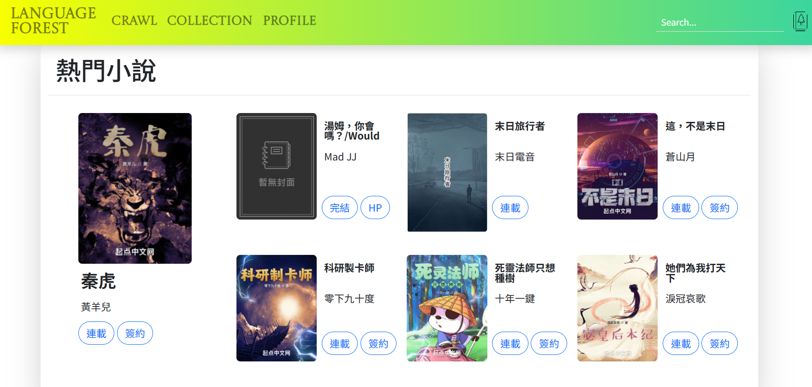
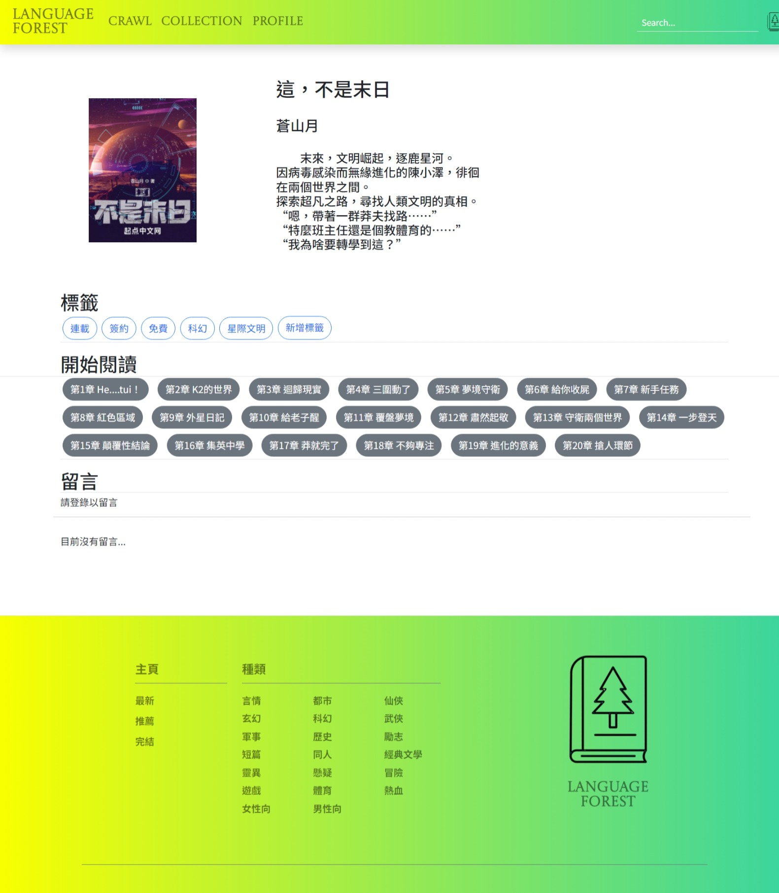

# Novelreader
##	網頁名稱
**Language Forest**

## 網頁目的與功能
### 一、個人化收藏小說 :
在我們的平台上，您可以輕鬆地收藏您喜歡的小說，並建立屬於自己的個人化收藏清單。無論是已經閱讀過的精彩故事還是想要未來閱讀的書籍，都可以輕鬆地加入到您的收藏中。這樣，您可以隨時回顧您喜歡的作品，並快速找到下一本想要閱讀的小說。

### 二、AI自動判讀文章撥放背景音樂 :
我們的平台擁有智能的AI技術，能夠自動分析文章的情感和氛圍，並根據內容為您選擇最適合的背景音樂。無論是緊張刺激的場景還是溫馨感人的情節，我們的音樂都將為您的閱讀體驗增添更多色彩。

### 三、使用者一鍵抓取不同平台的小說:
我們了解到許多讀者喜歡在不同的網站上尋找自己喜愛的小說，因此我們設計了一個便捷的功能，讓您只需點擊一下按鈕，即可輕鬆爬取其他網站上的小說，將它們整合到我們的平台上，或是下載到自己的電腦，讓您在一個地方就能找到所有想看的小說。

### 四、頁面設計
主頁面

  
小說頁面

